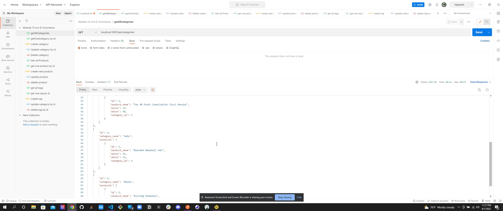

# E-commerce

## Description

This is a back end for an e-commerce site using starter code. Using a Express.js API and configuring it to use Sequelize to interact with a MySQL database. In the application you test api routes for POST,Put,Delete, and Get. From there you can succesfully update your e-commerce store .

Recorded video Link:https://drive.google.com/file/d/1HQ5JMw_syGEC_s5vff5o1-oCwrMOvQE0/view
Repository Link:https://github.com/Zachary-Maddox/E-Commerce

## Table of contents

-   [license](#license)
-   [installation](#installation)
-   [usage](#usage)
-   [contributing](#contributing)
-   [questions](#questions)

## License

None

## Installation

Open terminal and run npm i (install)

## Usage

Install Packages required with NPM i . NPM run seed , NPM run watch ,activates nodemon.
Connect to a database and go to Insomnia,Postman etc.. Run the routes provided. Check terminal/body for data

## Contributing

You may fork the repository and create pull requests to be approved.

## Questions

Any further questions can be asked via GitHub Username: Zachary-Maddox or Email z19s96p@aol.com .
